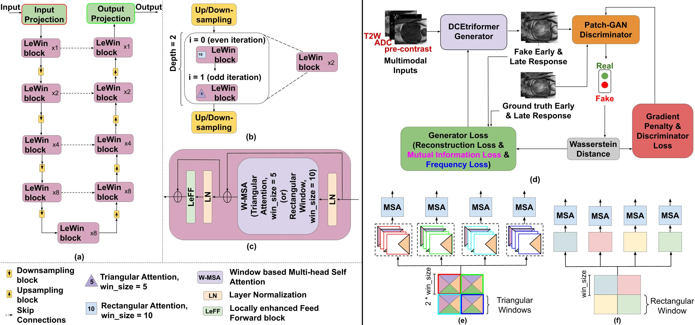

Hey there! This is the official pytorch implementation of DCEtriformer :)
____
# DCEtriformer
DCEtriformer is a transformer-based model for synthesizing early- and late-phase DCE-MRI images of the prostate from non-contrast inputs (T2W, ADC, and pre-contrast DCE). It introduces a hybrid attention mechanism combining triangular and rectangular self-attention with variable window sizes, enabling better directional focus and contrast-aware synthesis.
____
##  Overview
- **Input**: T2-weighted (T2W), Apparent Diffusion Coefficient (ADC), and Pre-contrast DCE images
- **Output**: Early- and Late-phase synthetic DCE-MRI images
- **Backbone**: Uformer-based encoder-decoder with LeWin Transformer blocks
- **Key Innovations**:
  - Alternating triangular and rectangular window attention
  - Variable window sizes (5×5, 10×10)
  - Fine-tuning on lesion-enhancing slices for clinical relevance
  - Generalization across datasets (PROSTATEx, Prostate-MRI)
____
## Overall Architecture

____
## Model Training
To train the model, run the train.sh file
<pre> sh train.sh </pre>
____
## Model Evaluation
To test the model, run valid.sh
The reconstructions are saved in a directory
<pre> sh valid.sh </pre>
____
## Metrics & Report generation
To compute the metrics (PSNR, SSIM, MSE etc.,), run evaluate.sh
<pre> sh evaluate.sh </pre>

